# Comparison of modern activation functions in neural networks. Summary of qualifying work for a bachelor's degree, spring 2024.

When analyzing the known activation functions, we can notice some properties of the curves especially useful during training process. If we try to combine them into one function, one possible result would be Smooth Logarithmic Unit (SLU):

$$\text{SLU}(x) =
\begin{cases}
    x + k \ln^2{(x + 1)}                 &  x \geq 0 \\
    k \ln^2{(-x + 1)} - \ln{(-x + 1)}    &  x < 0
\end{cases}$$

where $k$ is a trainable parameter.

There are two options of how to use this function: share $k$ for all outputs of a layer (*shared configuration*) or have a distinct $k$ for each of layer outputs (*individual configuration*).

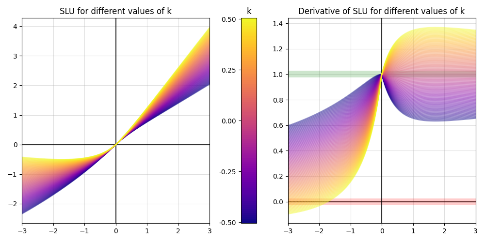
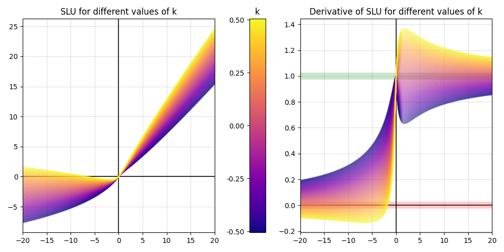

The formula can also be transformed for convenience:

$$
A = \ln{(1 + |x|)} \qquad B = k A^2 \qquad
SLU(x) =
\begin{cases}
    x + B    &  x \geq 0 \\
    B - A    &  x < 0
\end{cases}\\
$$

## Properties:

1. Linearity for sufficiently large positive values of the argument
    $$\lim_{x \to +\infty}{\frac{\partial f(x)}{\partial x}} = 1$$

    $$\lim_{x \to +\infty}{\left( 1 + \frac{2k \ln{(x + 1)}}{x + 1}\right)} =
    1 + 2k \lim_{x \to +\infty}{\frac{\ln{(x + 1)}}{x + 1}} = 1$$

2. Constant for sufficiently large negative values of the argument
    $$\lim_{x \to -\infty}{\frac{\partial f(x)}{\partial x}} = 0$$

    $$\lim_{x \to -\infty}{\left(\frac{1 - 2k \ln{(-x + 1)}}{-x + 1}\right)} =
    \lim_{x \to -\infty}{\frac{1}{-x + 1}} -2k \lim_{x \to -\infty}{\frac{\ln{(-x + 1)}}{-x + 1}} = 0$$

3. Smoothness
    $$\forall x_0 \in \mathbb{R}: \lim_{x \to x_0 - 0}{f(x)} = \lim_{x \to x_0 + 0}{f(x)} = f(x_0)$$

    The SLU is composed of two functions that are smooth on the specified intervals. The only thing left to check is the point where these functions meet:

    $$\lim_{x \to -0}{f(x)} = \lim_{x \to +0}{f(x)} = f(0)$$

    $$\lim_{x \to -0}{f(x)} = \lim_{x \to -0}{\left(k \ln^2{(-x + 1)} - \ln{(-x + 1)}\right)} = 0$$

    $$\lim_{x \to +0}{f(x)} = \lim_{x \to +0}{\left(x + k \ln^2{(x + 1)}\right)} = 0$$

4. Optional bijectivity for most argument values
    $$\frac{\partial}{\partial x} \text{SLU} > 0$$

    1) $x \geq 0$
        $$\frac{\partial}{\partial x} \text{SLU}_{+} = 1 + \frac{2k \ln{(x + 1)}}{x + 1} > 0$$

        $$k > -\frac{x + 1}{2 \ln{(x + 1)}}$$

        $$\max_{x \in \mathbb{R}_{+}}{\left(-\frac{x + 1}{2 \ln{(x + 1)}}\right)} = -\frac{e}{2}$$

        $$k > -\frac{e}{2} \approx -1.359$$

    2) $x < 0$
        $$\frac{\partial}{\partial x} \text{SLU}_{-} = \frac{1 - 2k \ln{(-x + 1)}}{-x + 1} > 0$$

        $$k < \frac{1}{2 \ln{(-x + 1)}}$$

        $$\min_{x \in \mathbb{R}_{-}}{\left(\frac{1}{2 \ln{(-x + 1)}}\right)} \to 0$$

        $$k \leq 0$$

    The derivative is zero at only one point, so we can include $-e/2$. Thus, the function is bijective at $k \in [-e/2;\ 0]$.

    It's worth noting that the upper bound $k$ is zero only if we want to restrict all negative values of $x$, which is not always the case. As mentioned above, it will be enough to make the function bijective where we expect to receive all values of the argument. The maximum value of $k$ in terms of $x$ and the minimum value of $x$ in terms of $k$ can be found by the following formulas:
    $$k_{max}(x_{min}) = \frac{1}{2 \ln{(-x_{min} + 1)}}; \qquad x_{min}(k_{max}) = -\exp{\frac{1}{2 k_{max}}} + 1.$$

    For example, for $x_{min} = -3$, we get $k_{max} = 0.361$.

$$ELU_{\alpha = 1}(x) =
\begin{cases}
    x              &  x \geq 0 \\
    \exp(x) - 1    &  x < 0
\end{cases}\\
$$

$$SLU_{k = 0}(x) =
\begin{cases}
    x                  &  x \geq 0 \\
    - \ln{(-x + 1)}    &  x < 0
\end{cases}\\
$$

$$\exp(x) - 1 \approx x + \frac{x^2}{2!} + \frac{x^3}{3!}$$

$$- \ln{(-x + 1)} \approx x + \frac{x^2}{2} + \frac{x^3}{3}$$

Thus, the difference between the values of the functions is $\frac{x^3}{6}$ for negative values of the argument and 0 for positive values. We conclude that SLU can, if necessary, repeat the behavior of ELU for sufficiently small values of the argument.

## Approximation of one-dimensional functions

To illustrate the advantages of the nonlinear activation function over ReLU, an experiment of one-dimensional regression was conducted, which is the approximation of one-dimensional functions over a certain interval. Three fully connected networks with a fixed number of layers and neurons were used (2 layers of 5 neurons each, and an initial layer with a single neuron without activation). In the first network, ReLU was used as the activation function, in the second, SLU with a shared parameter (1 parameter per layer, 2 in total) was used, and in the third, SLU with individual parameters was used (1 parameter per neuron, i.e., 10 parameters).

$$y = x^2$$

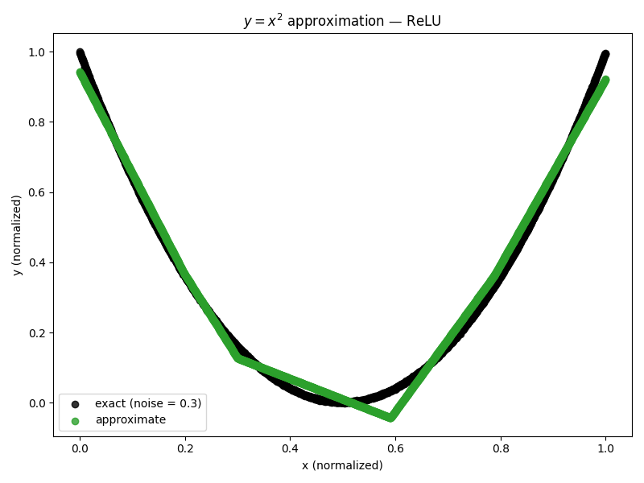 | /approximation.png) | /approximation.png)
-|-|-

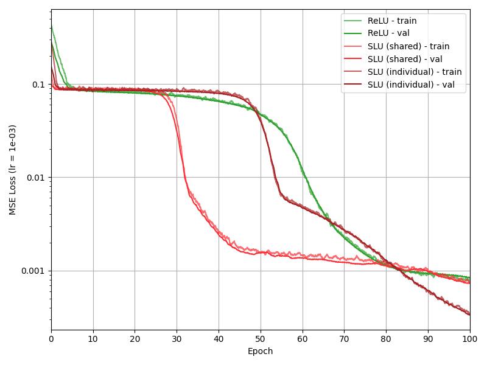

$$y = \sqrt{x}$$

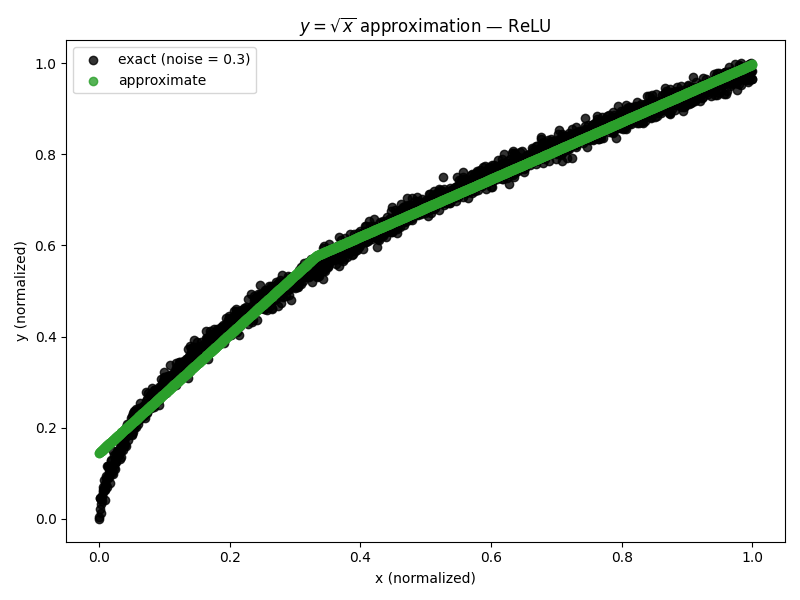 | /approximation.png) | /approximation.png)
-|-|-

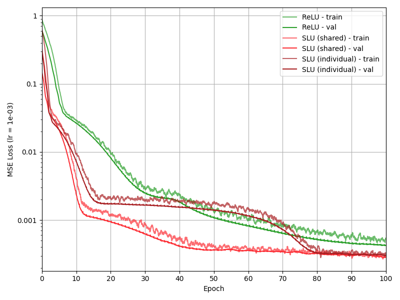

$$y = \frac{1}{x}$$

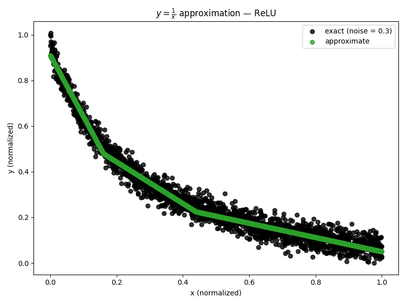 | /approximation.png) | /approximation.png)
-|-|-

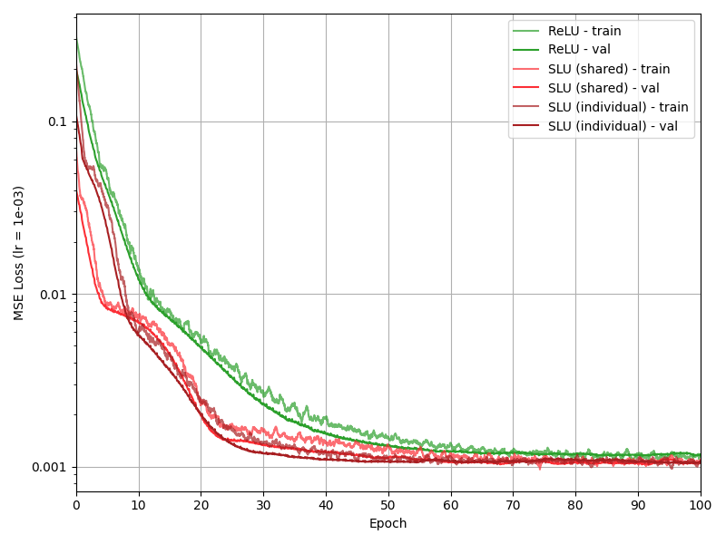

## Binary classification of two-dimensional points

Next, a series of experiments were conducted to solve a simple binary classification problem: to separate two classes of data in two-dimensional space. The architecture of the networks has not changed much from the previous paragraph, but there are two neurons at the input instead of one (now the data is two-dimensional), and a sigmoid is added to the output.

### Moons

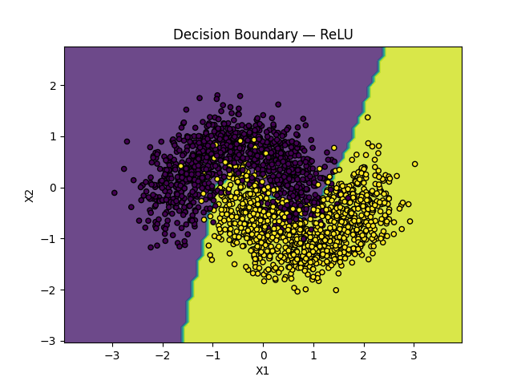 | /classification.png) | /classification.png)
-|-|-

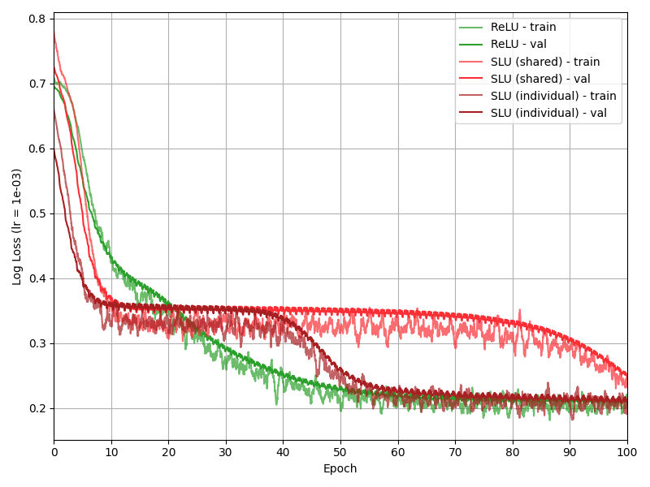

### Spirals

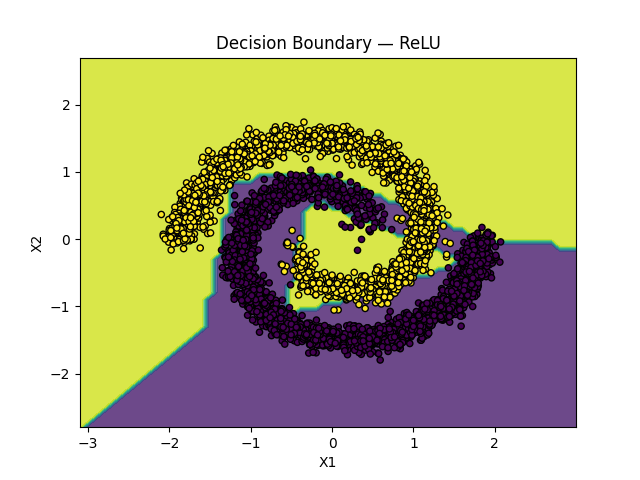 | /classification.png) | /classification.png)
-|-|-

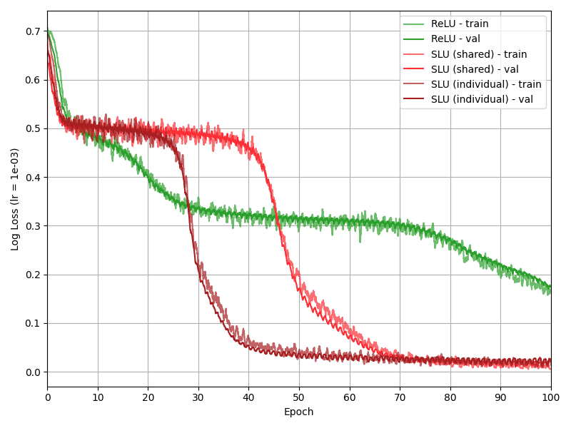

## MNIST classification of handwritten digits

The next set of experiments is devoted to the classification of handwritten digits on the MNIST dataset. There were 4 experiments to train fully connected neural networks with different numbers of neurons and layers:
- 4 layers of 64 neurons;
- 8 layers of 64 neurons;
- 4 layers of 128 neurons;
- 8 layers of 128 neurons.

The purpose of these experiments is to compare the learning dynamics and the resulting accuracy on a more complex classification task. The number of experiments in this section is explained by the fact that the dependence of the results on the network depth and the number of neurons is of interest for several reasons:
1. Increasing the number of network parameters makes it difficult to find the points in the parameter space where the prediction error is minimal. Given that the proposed activation function has its own parameters (one parameter either for each layer or for each neuron), it is interesting to see whether this fact will negatively affect the learning speed.
2. Infinite deepening of the network cannot lead to infinite improvement of the quality of predictions, and this dataset is a perfect example of this. MNIST is traditionally used to test fairly simple architectures, and the set of experiments will demonstrate the impact of each of the activation functions on the resilience of networks to overfitting.
3. This dataset has already been used in [4] and [5], also with fully connected networks. We take this opportunity to compare our results with those presented in the papers and see if the difference in implementation has a significant impact on them.

### 4x64

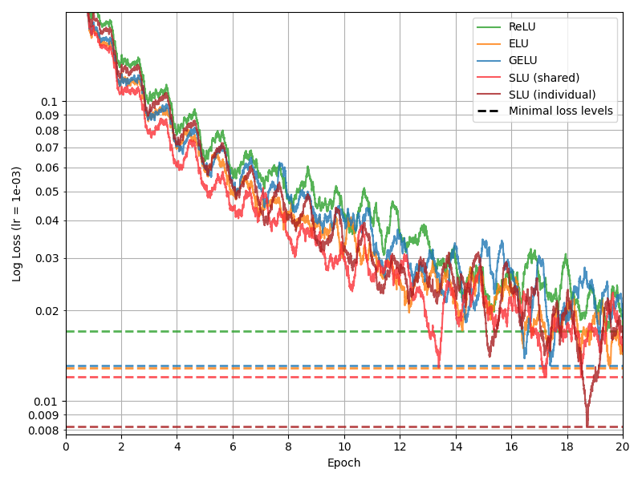 | 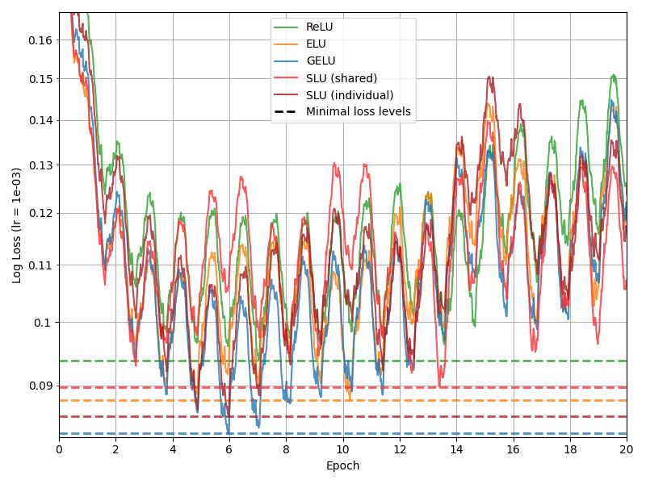
-|-

### 8x64

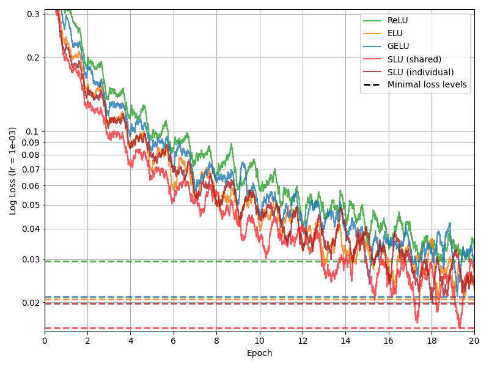 | 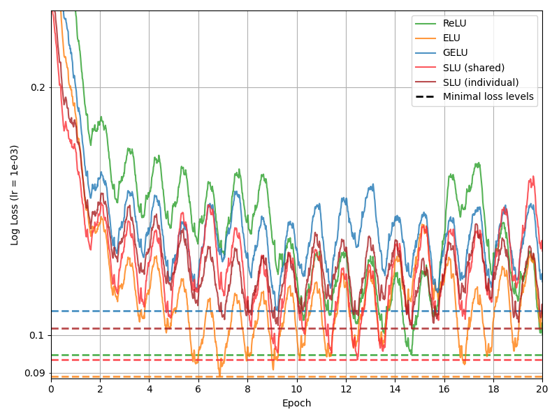
-|-

### 4x128

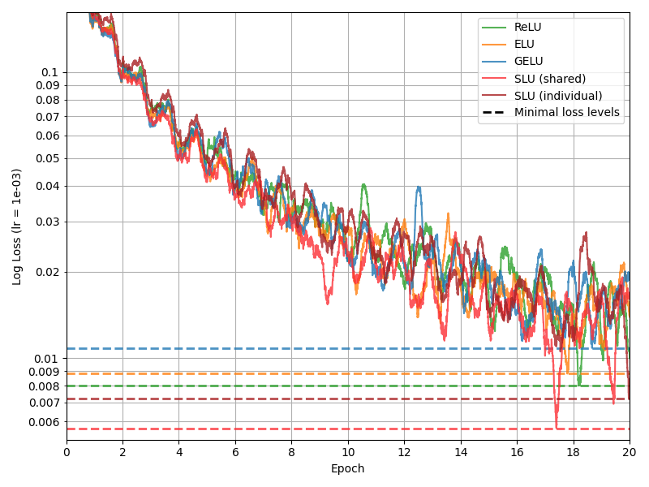 | 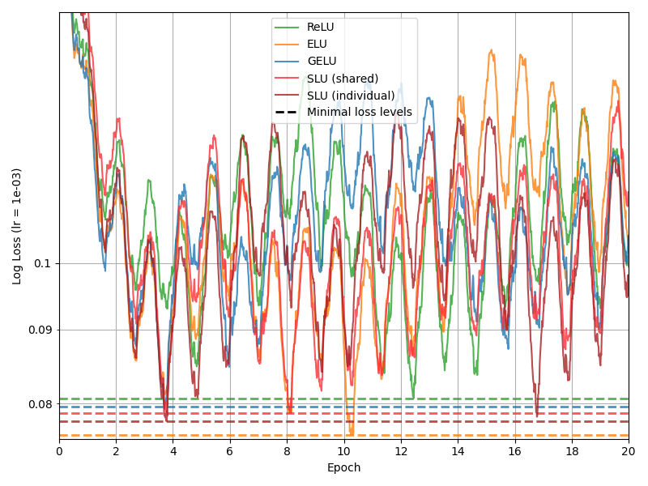
-|-

### 8x128

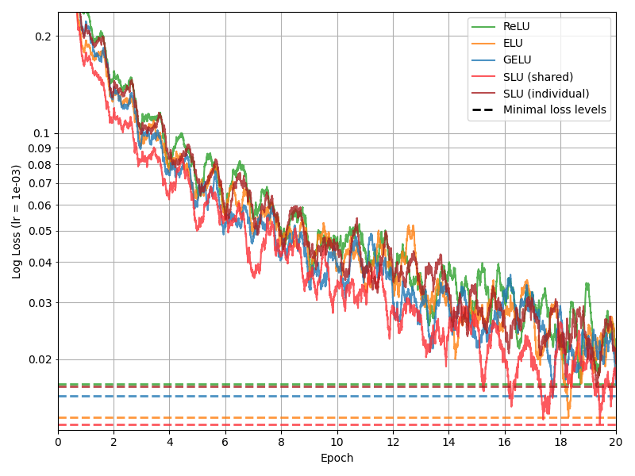 | 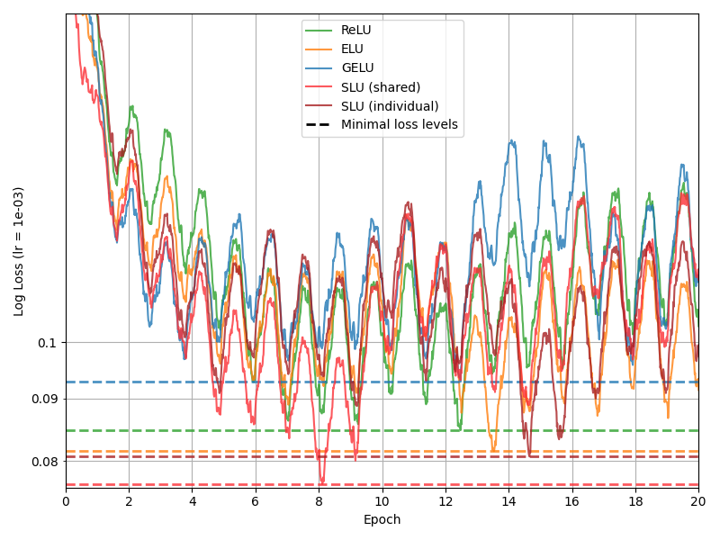
-|-

### Results

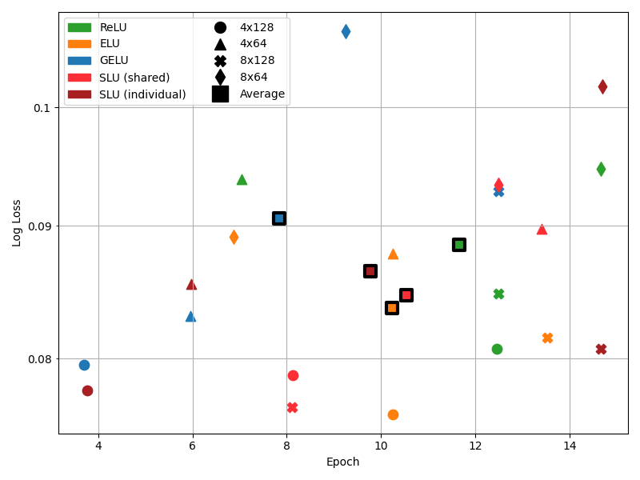

<table>
<tr><td>

Network (4x64) | Epoch | Best Loss
-|-|-
ReLU | 7.0385 | 0.0938
ELU | 10.2479 | 0.0878
GELU | 5.9504 | 0.0831
SLU (shared) | 13.4022 | 0.0897
SLU (individual) | 5.9779 | 0.0855

</td><td>

Network (8x64) | Epoch | Best Loss
-|-|-
ReLU | 14.6556 | 0.0947
ELU | 6.8732 | 0.0891
GELU | 9.2424 | 0.1070
SLU (shared) | 12.4793 | 0.0933
SLU (individual) | 14.6831 | 0.1018

</td>
</tr>
<tr>
<td>

Network (4x128) | Epoch | Best Loss
-|-|-
ReLU | 12.4517 | 0.0806
ELU | 10.2479 | 0.0761
GELU | 3.7052 | 0.0795
SLU (shared) | 8.1267 | 0.0788
SLU (individual) | 3.7741 | 0.0777

</td>
<td>

Network (8x128) | Epoch | Best Loss
-|-|-
ReLU | 12.4793 | 0.0847
ELU | 13.5261 | 0.0815
GELU | 12.4793 | 0.0928
SLU (shared) | 8.1129 | 0.0766
SLU (individual) | 14.6556 | 0.0806

</td>
</tr>
</table>

Network | Epoch | Best Loss
-|-|-
ELU 4x128 | 10.2479 | 0.0761
SLU (shared) 8x128 | 8.1129 | 0.0766
SLU (individual) 4x128 | 3.7741 | 0.0777
SLU (shared) 4x128 | 8.1267 | 0.0788
GELU 4x128 | 3.7052 | 0.0795
ReLU 4x128 | 12.4517 | 0.0806
SLU (individual) 8x128 | 14.6556 | 0.0806
ELU 8x128 | 13.5261 | 0.0815
GELU 4x64 | 5.9504 | 0.0831
ReLU 8x128 | 12.4793 | 0.0847
SLU (individual) 4x64 | 5.9779 | 0.0855
ELU 4x64 | 10.2479 | 0.0878
ELU 8x64 | 6.8732 | 0.0891
SLU (shared) 4x64 | 13.4022 | 0.0897
GELU 8x128 | 12.4793 | 0.0928
SLU (shared) 8x64 | 12.4793 | 0.0933
ReLU 4x64 | 7.0385 | 0.0938
ReLU 8x64 | 14.6556 | 0.0947
SLU (individual) 8x64 | 14.6831 | 0.1018
GELU 8x64 | 9.2424 | 0.1070

Activation function | Average Epoch | Average Loss
-|-|-
ELU | 10.2238 | 0.0836
SLU (shared) | 10.5303 | 0.0846
SLU (individual) | 9.7727 | 0.0864
ReLU | 11.6563 | 0.0884
GELU | 7.8443 | 0.0906

## CIFAR-10

The next set of experiments is devoted to the classification of color images of objects in the CIFAR-10 dataset. Two experiments were conducted using different architectures:
- a fully connected network with 4 layers of 64 neurons each;
- a convolutional network (architecture taken from [5], Appendix A).

This task is more complex than the MNIST classification and is also often used in benchmarking. The experiments are aimed at comparing the effects of activation functions on the behavior of networks with the same dataset but different architectures.

### FC 4x64

 | 
-|-

### CNN

 | 
-|-

### Results

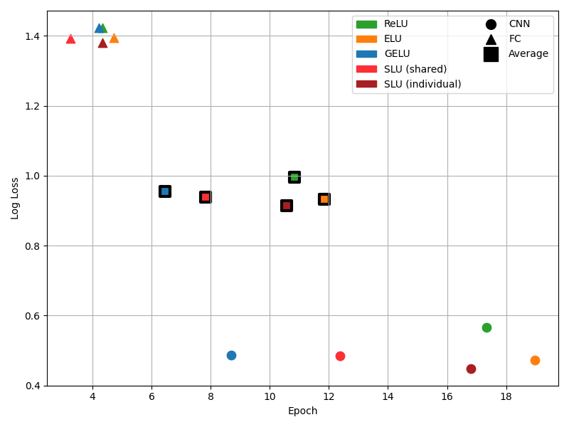

<table>
<tr><td>

Network (FC) | Epoch | Best Loss
-|-|-
ReLU | 4.3388 | 1.4231
ELU | 4.7245 | 1.3942
GELU | 4.2148 | 1.4226
SLU (shared) | 3.2506 | 1.3931
SLU (individual) | 4.3388 | 1.3810

</td><td>

Network (CNN) | Epoch | Best Loss
-|-|-
ReLU | 17.3278 | 0.5669
ELU | 18.9807 | 0.4724
GELU | 8.6914 | 0.4861
SLU (shared) | 12.3829 | 0.4842
SLU (individual) | 16.8044 | 0.4486

</td>
</tr>
</table>

Network | Epoch | Best Loss
-|-|-
SLU (individual) CNN | 16.8044 | 0.4486
ELU CNN | 18.9807 | 0.4724
SLU (shared) CNN | 12.3829 | 0.4842
GELU CNN | 8.6914 | 0.4861
ReLU CNN | 17.3278 | 0.5669
SLU (individual) FC | 4.3388 | 1.3810
SLU (shared) FC | 3.2506 | 1.3931
ELU FC | 4.7245 | 1.3942
GELU FC | 4.2148 | 1.4226
ReLU FC | 4.3388 | 1.4231

Activation function | Average Epoch | Average Loss
-|-|-
SLU (individual) | 10.5716 | 0.9148
ELU | 11.8526 | 0.9333
SLU (shared) | 7.8168 | 0.9386
GELU | 6.4531 | 0.9544
ReLU | 10.8333 | 0.9950

# Conclusion

The ELU evaluation managed to reproduce the results of [4]. GELU did not show the results indicated by the conclusions of [5], which may indicate the sensitivity of the indicators obtained in the paper to implementation. SLU showed results strictly better than ReLU (12.9% faster and 3.3% more accurate on MNIST, 17.8% faster and 7.4% more accurate on CIFAR-10) and comparable to other activation functions.

# References

1. Nair, V. and Hinton, G. E. Rectified linear units improve restricted Boltzmann machines. In F¨urnkranz, J. and Joachims, T. (eds.), Proceedings of the 27th International Conference on Machine Learning (ICML10), pp. 807–814, 2010.
2. Glorot, X., Bordes, A., and Bengio, Y. Deep sparse rectifier neural networks. In Gordon, G., Dunson, D., and Dudk, M. (eds.), JMLR W&CP: Proceedings of the Fourteenth International Conference on Artificial Intelligence and Statistics (AISTATS 2011), volume 15, pp. 315–323, 2011.
3. Lu L. Dying ReLU and Initialization: Theory and Numerical Examples. Communications in Computational Physics. 2020. Vol. 28, no. 5. P. 1683. URL: https://doi.org/10.4208/cicp.oa-2020-0165 (date of access: 04.05.2024).
4. Clevert D.-A., Unterthiner T., Hochreiter S. Fast and Accurate Deep Network Learning by Exponential Linear Units (ELUs). International Conference on Learning Representations. 2015. URL: https://doi.org/10.48550/arXiv.1511.07289 (date of access: 07.02.2024).
5. Hendrycks D., Gimpel K. Gaussian Error Linear Units (GELUs). 2016. URL: https://doi.org/10.48550/arXiv.1606.08415 (date of access: 07.02.2024).
